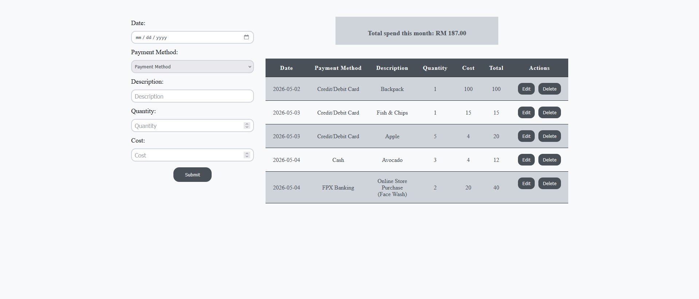
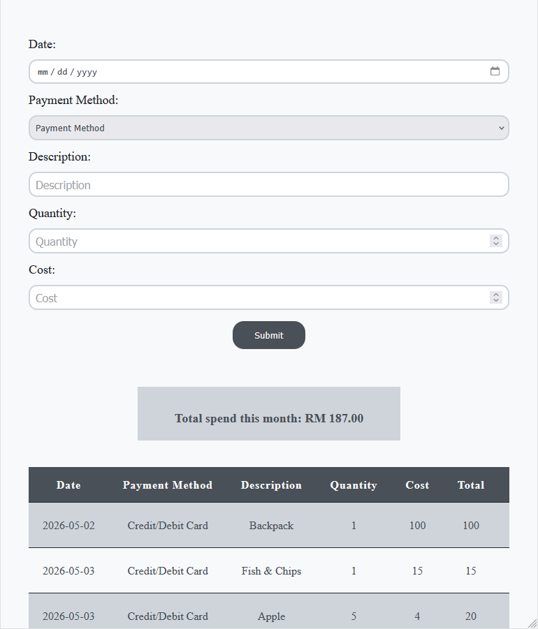

# Reshito

## About

- An application that focus on privacy-first & open-source for daily expenses tracking 

## Features

- Expense Form Submit
- Monthly Total Summary
- Expenses Table History (Can edit & delete each for each expenses)
- Mobile responsive (768px and above)

## Tech Stack

- HTML5
- CSS
- JavaScript

## How to Use

- Clone the repository to your local machine.
- Open the FOLDER in your preferred IDE (e.g., VSCode, IntelliJ, Cursor etc.).
- Download Live Server extension
- Right click index.html, choose Open with Live Server
- Now you are in http://127.0.0.1:5500/index.html

## What I Learned

- Structuring with HTML
- Design layout with CSS (Box Model → Flexbox → Form → Button → Table → Error → Grid → Positioning → Responsive)
- Interactive with JavaScript
- DOM Features between HTML & JavaScript
- Advanced JavaScript (Arrow Function, Destructuring)
- Git & GitHub (Version Control)